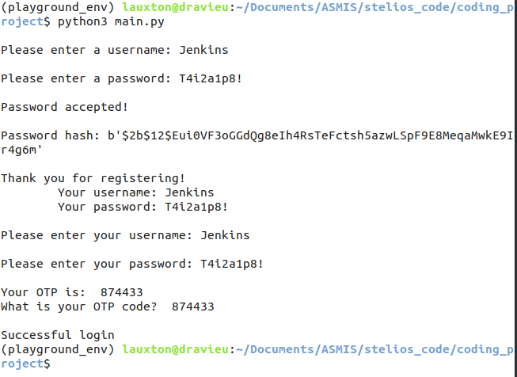
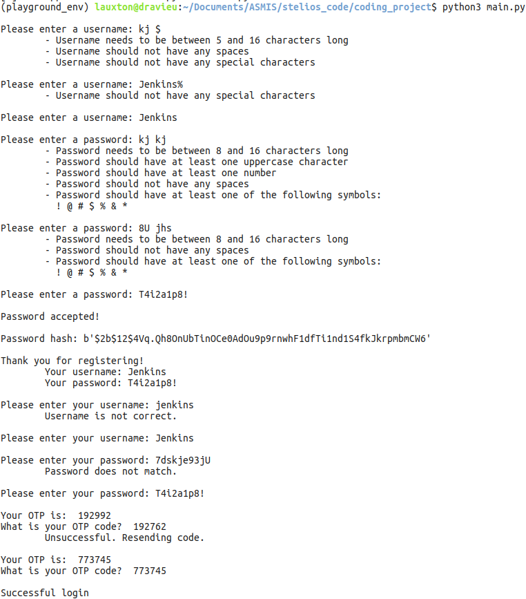

### Username and Password Registration and Login with Two Factor Authentication

### Table of Contents

1. Program Purpose
2. Code Construction
3. Execution
4. Optional Test Code
5. References

### 1. Purpose

This program is meant to provide two functions:

1. register a username and password within a certain criteria 
    - the criteria is meant to prevent the following attacks[^1]
        - cross-site scripting
        - SQL injection
        - cross-site relay
        - man-in-the-middle

    - username criteria:
        - length between 5 and 16 characters
        - no spaces between characters
        - no special symbols

    - password criteria:
        - length between 8 and 16 characters
        - at least one uppercase character included
        - at least one digit included
        - no spaces between characters
        - at least one of the following special symbols included: ! @ # $ % &
        - produce a salted hash of the accepted password

2. provide a secure user login
    - the username must match with a case-specific cross-check
    - the password must match the salted hash archived
    - user must provide an OTP through Two Factor Authorization

### 2. Code Construction

The program has been written with an object-oriented approach, as this approach
> is defined by describing a collection of interacting objects via their data and behavior[^2],
and thus allows for the easy manipulation of objects through functions.

The following classes are used to create a username and password:

    '''
    CreateUsername
    CreatePassword
    EncryptPass
    '''

These classes and functions can be viewed indepth in create_user_classes.py

The login program uses two separate classes:

    '''
    VerifyUser
    VerifyPass
    '''

These classes and functions can be viewed indepth in login_classes.py

The program in main.py has imported these classes along with 'install pyotp' to implement Two Factor Authorization.

An empty dictionary 'user_1 = {}' stores the user profile input and provides cross-check information for the subsequent login program.

Each password and username criteria functions are placed inside a while-loop, and assigns an integer value of 1 to acceptable input.

This integer value is added to the empty list 'success = []', which then adds a positive integer increment to the variable 'success_count = 0'.

Once the intrement count reaches a pre-determined integer, the input is deemed valid, hashed (if appropriate) and appended to the user dictionary.

This stored information is then used to cross-check the username and password upon user login. A successful entry of the password is required to engage Two Factor Authorization.

### 3. Execution

Execution of the program results in the following:

The program also provides instructions for input that does not meet the username or password criteria for registration and/or login:

### 4. References
#### Cited References
[^1]
[^2]
